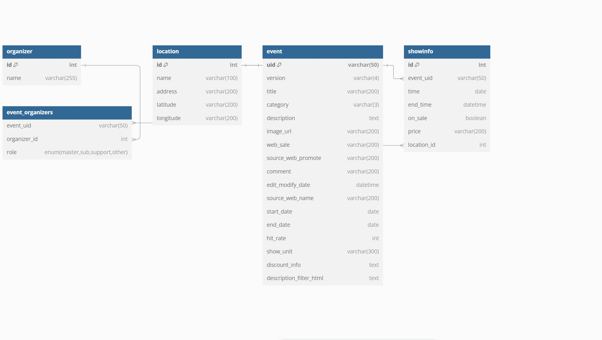

## 資料庫正規化

資料庫正規化是一種設計數據庫表結構的過程，目的是減少數據冗餘和提高數據一致性。正規化主要包括以下幾個階段：

1. **第一正規化（1NF）**:
   - 第一確保每個表格的每一列都是原子性的，即每個列中的數據都是不可再分的基本數據單位，第二消除意義上重複的欄位，第三設定主鍵
   - 以本次資料為例，這次傳入的json檔的showinfo會超過一個，我們要讓一個欄位只有單一值，所以要進行拆分

2. **第二正規化（2NF）**:
   - 一般發生在有複合主鍵的情況下，Django不另外設定主鍵，通常只有ID一個主鍵。第二正規化要消除部分相依
     部分相依就是主鍵只有一部份有關係，另一部份沒有關係的欄位，我們要把這些欄位獨立於另一張表。

3. **第三正規化（3NF）**:
   - 消除遞移相依，舉例來說，欄位1和主鍵相關，欄位2和欄位1相關，欄位2和主鍵就是遞移相依。

# 資料庫設計


# 函數功能

以下是主要函數功能的概述：

### `OperationPageView`
- **功能**: 渲染操作頁面 (`operation.html`)。

### `HomePageView`
- **功能**: 渲染首頁 (`home.html`)。

### `RegisterView`
- **功能**: 提供註冊頁面和處理註冊請求。
  - **GET 請求**: 顯示註冊表單。
  - **POST 請求**: 處理表單提交，創建新用戶，並重定向到登錄頁面。

### `LoginView`
- **功能**: 提供登錄頁面和處理登錄請求。
  - **GET 請求**: 顯示登錄表單。
  - **POST 請求**: 驗證用戶憑證，登錄用戶，並重定向到操作頁面。

### `AllEventsView`
- **功能**: 顯示所有事件的列表 (`event_list.html`)。
  - **查詢集**: 按 `hit_rate` 排序的所有事件。
  - **分頁**: 每頁顯示 20 個事件，避免一次全部查找，增進效能。

### `EventsDetailView`
- **功能**: 顯示事件的詳細資訊 (`event_detail.html`)。
  - **上下文數據**: 包括與事件相關的所有 `ShowInfo` 對象，並通過 `select_related` 加載位置信息，

### `EventDelete`
- **功能**: 刪除事件 (`event_confirm_delete.html`)。
  - **要求登錄**: 僅限登錄用戶訪問。
  - **成功重定向**: 刪除後重定向到操作頁面。

### `ShowInfoDelete`
- **功能**: 刪除 `ShowInfo` 對象 (`showinfo_confirm_delete.html`)。
  - **要求登錄**: 僅限登錄用戶訪問。
  - **成功重定向**: 刪除後重定向到 `showinfo_list` 頁面。

### `EventUpdateView`
- **功能**: 更新事件 (`event_form.html`)。
  - **字段**: 包括事件的各種屬性。
  - **要求登錄**: 僅限登錄用戶訪問。
  - **成功重定向**: 更新後重定向到操作頁面。

### `ShowInfoUpdateView`
- **功能**: 更新 `ShowInfo` 對象 (`showinfo_form.html`)。
  - **字段**: 包括 `ShowInfo` 的各種屬性。
  - **要求登錄**: 僅限登錄用戶訪問。
  - **成功重定向**: 更新後重定向到 `showinfo_list` 頁面。


# Docker

當面對需要在Ubuntu 20.04系統上開發的需求時，選擇 Docker 作為開發環境的工具相比於傳統的虛擬機有著顯著的優勢。Docker的主要好處在於它能夠提供一種輕量級的虛擬化技術，使得我們可以在一個一致的環境中進行開發和測試，這樣可以有效減少環境配置的問題。

首先，Docker容器的啟動速度比虛擬機快得多。由於容器直接共享宿主機的操作系統內核，不需要啟動整個操作系統，這樣可以大大節省啟動和運行時間。這使得開發者能夠更快地進行測試和部署，提升開發效率。

其次，Docker容器化的應用程序具有高度的一致性，因為每個容器都包含了運行應用所需的所有依賴和配置文件。這樣可以確保在不同環境中，應用程序的行為保持一致，從而減少由於環境差異引發的問題。

此外，Docker還提供了簡單的版本控制和部署功能。開發者可以使用 Docker 映像來管理應用程序的版本，並且可以輕鬆地將應用程序部署到生產環境中。這種便捷的操作方式在虛擬機中則需要更多的配置和管理。

總結來說，Docker 以其快速啟動、一致性高以及方便的版本控制等特點，相比傳統虛擬機，在開發環境配置和管理上提供了更為高效和靈活的解決方案。

## 設定自動更新資料

為了確保每日 01:00:00 (UTC+8) 自動從政府資料開放平台抓取資料並更新資料庫，我在AWS EC2上設置一個定時任務。我們使用`cron`工具來實現這一功能。以下是設置步驟：

### 1. 檢查 Django 管理命令

在設置 `cron` 任務之前，首先確保 Django 管理命令能夠在命令行中正常運行。您可以使用以下命令進行測試：

```sh
python manage.py update_data
```

### 2. 在AWS虛擬機編寫檔案

```sh
crontab -e
```
### 3. 添加定時任務

在 crontab 文件中添加以下行以安排每日 01:00:00 (UTC+8) 執行您的 Django 管理命令：

```sh
00 * * * /usr/bin/python3 /path/to/your/project/manage.py update_data >> /path/to/your/logfile.log 2>&1
```

## 4. 查看mongodb
    1. 進入mongodb shell依序輸入:
    mongosh
    use crawl_logs
    show collections
    db.crawl_logs.find().pretty()


## 部屬

1. 使用AWS EC2，使用ubuntu 20.04作業系統，安全組設定為: HTTP (80)、SSH (22)與HTTPS(443)

2. 安裝Apach2.0與WSGI

3. 執行docker，並設定apach配置文件，完成Django部署

4. 連結
    [連結文字](https://ilovenukumizukaju.org)


